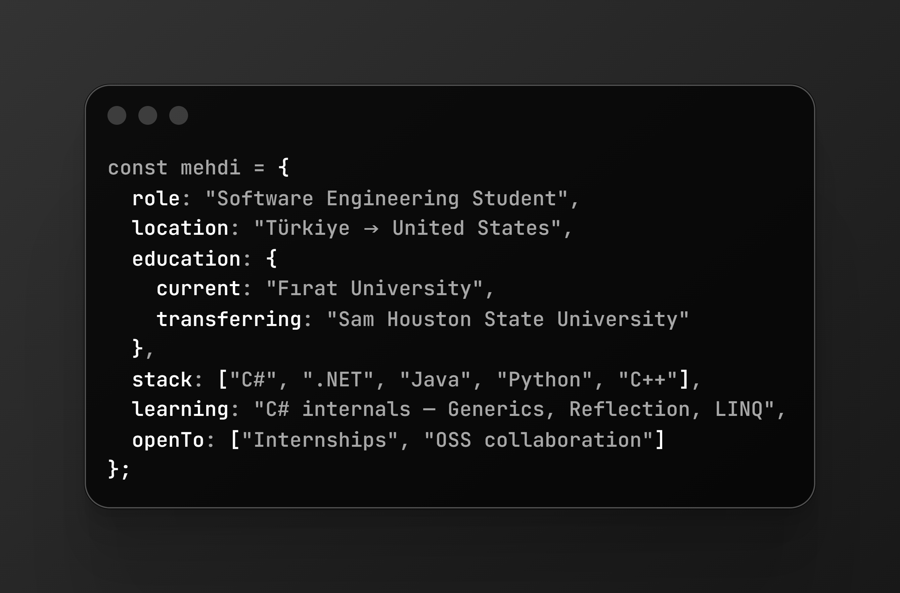

<!-- ─── Animated Header ─── -->

  

<!-- ─── Typing Subtitle ─── -->

  

 

## ▸ About

  

 

**Now** — `28-day C# Challenge`  
Daily commits on Generics, Reflection, Multithreading, and LINQ internals.

**Goal** — Transferring to **SHSU** for years 3–4.

 

## ▸ Stack

  

 

## ▸ Projects

#### [`csharp-learning`](https://github.com/chesendev/csharp-learning)
28-day deep-dive into C# language internals — daily commits.  
`C#` · `.NET`

 

<!-- ─── Footer ─── -->

  
### ▸ Connect

  

<i>Open to internships and open-source collaboration.</i>

